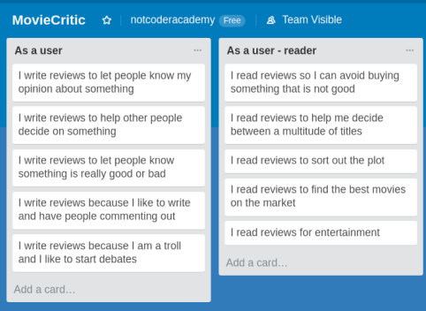

### Models
- User (Devise)
- Movie
- Review

#### User
- username
- email
- password

#### Movie
- Title
- Description
- Year_released
- Week_released
- Genre

#### Review
- Rating
- Comment
- User: references
- Movie: references

### ERD

### Trello

### Figma

### Features
## Movies
- Display This week movie
- Display all movies
- Search movies
- See movie details
- Rate movie

### Problems
- If you have installed the extension "Grammarly", the textarea in the write-review page will become hidden and another textarea will bounce up to the top-left of the page.
We fixed the probelm finding the added markup from Grammarly called 'grammarly-ghost' and gave it visibility: hidden. Since our textarea would become hidden because of Grammarly we also had to place a div around it with the same properties to act as a fallback.
